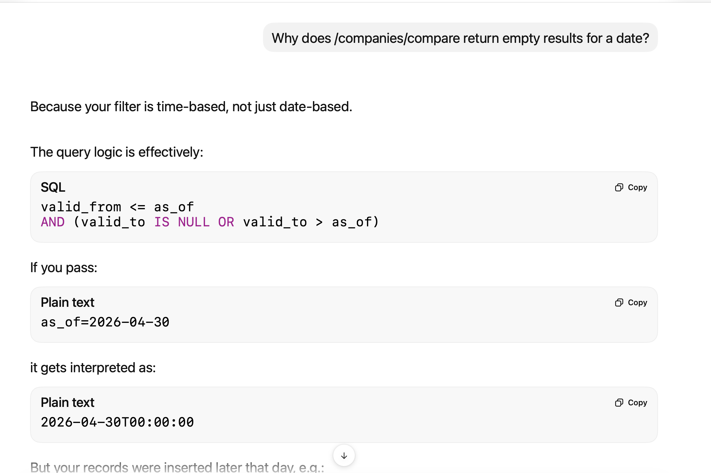
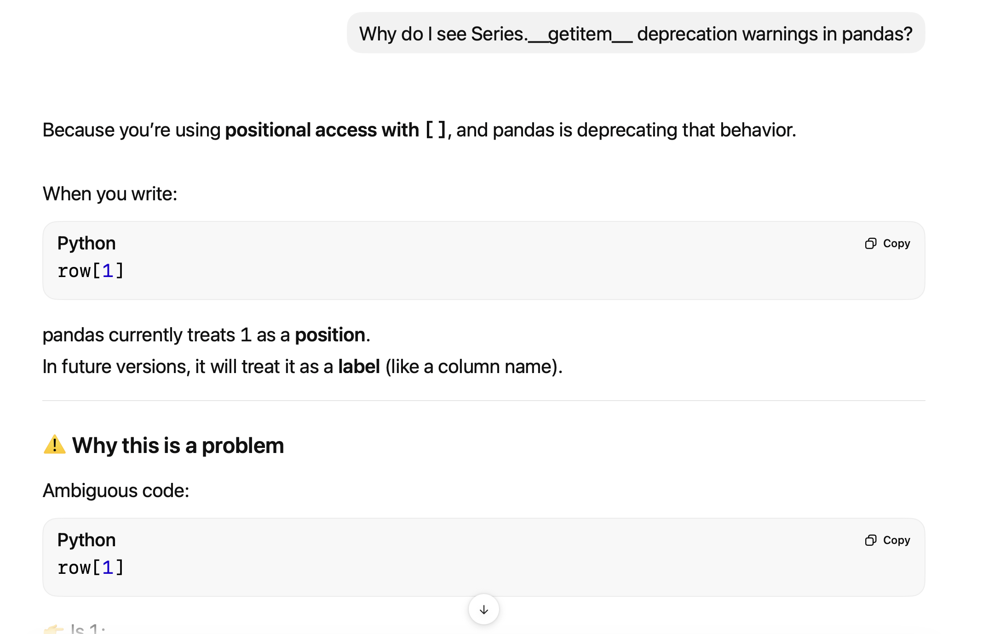

# AI Coding Assistance Disclosure

## 1. AI Tools Used

- ChatGPT (primary)  
- GitHub Copilot (minor, inline suggestions)

---

## 2. Components Assisted

- [x] Debugging specific issues  
- [x] Minor code scaffolding  
- [x] Documentation refinement  

---

## 3. Detailed Description

AI assistance was used selectively for:

- Debugging runtime issues (SQLAlchemy connections, Docker setup, FastAPI routing)
- Validating edge cases (time-based queries, idempotent loads)
- Minor scaffolding and code refinement

Core components — including data modeling (SCD Type 2) and pipeline orchestration.

---

## 4. Chat History / Logs

---

## 5. Self-Assessment

**What did AI do well?**  
Accelerated debugging, reduced iteration time, and helped validate implementation choices.

**What did you override or correct?**  
Data parsing assumptions, SQL query edge cases, and API behavior.

**What was implemented independently?**  
System design, schema modeling, and pipeline logic.

---

## 6. Recommendations

Use AI as a targeted assistant for debugging and validation, not as a substitute for system design.
